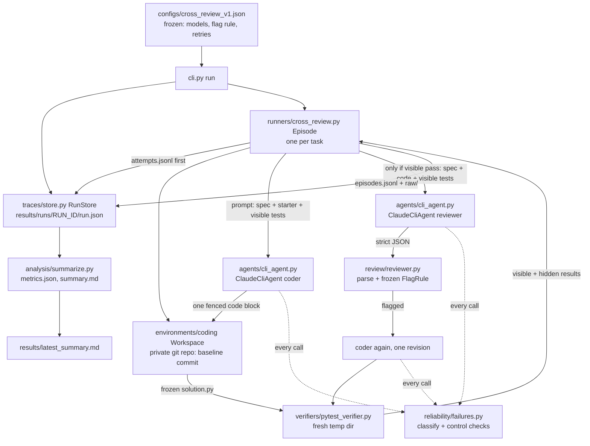

# Architecture (read this first tomorrow)

About 1,500 lines of stdlib Python (including tests) plus pytest. No framework, no database, no plugin system. One
experiment: for each coding task, one coder call, deterministic verification, one independent
review call and at most one revision call, all recorded.

## Picture



Hidden tests go to the verifier only. No arrow carries them to an agent.

## One episode, step by step (`runners/cross_review.py`, `Episode.run`)

1. Append `{episode_id, task_id, started_at}` to `attempts.jsonl` **before** any model call.
2. `Workspace(task, tmp)`: `git init`, commit `starter.py` as `solution.py` plus `test_visible.py`.
3. `_call(coder, "coder", prompt, extract_solution)`: the agent returns text; `extract_solution`
   requires exactly one fenced block. None is a `malformed_output`, which gets one retry. Every
   attempt's summary goes into `self.calls` and its full event stream goes to `raw/`.
4. `ws.commit_candidate(code)`: freezes the candidate and records its SHA and diff.
5. `_verify(code)`: `run_tests` twice (visible, hidden), each in its own fresh temp dir.
6. If visible failed: stop (A, B and C all reject).
7. `_call(reviewer, "reviewer", build_review_prompt(...), parse_review)`: strict JSON; malformed
   gets one retry.
8. `FlagRule` (from config) decides `flagged`. Recorded: verdict, all findings, blocking
   categories, actionable.
9. If flagged and `revision: true`: `_call(coder, "reviser", build_revision_prompt(...))`, commit,
   verify both suites again.
10. `finally`: the full episode record is appended to `episodes.jsonl`, even after an exception.

## Agent ↔ environment

The agent has no tools. It receives a prompt and returns text, and the harness does everything else:
it writes the file, commits and runs tests. This matches institutional-workbench's "only the host
writes files" and avoids trusting an agent's own claims about test results. It is a simplification
of agent-workflow-orchestrator, where CLI agents edit a worktree directly (see Shortcuts).

## Optional tool loop for the coder (`coder_mode: "tool_loop"`)

Added 3 October 2026; used by `configs/cross_review_tool_loop_v1.json`. The first run's config is
unchanged and still one-shot.

Instead of one call, the coder gets at most 5 steps (`Episode._tool_loop`). Each step is a separate
stateless model call whose prompt is the spec plus the transcript so far
(`build_agent_prompt`). The model replies with one `ACTION:` line (`parse_action`), and the
harness executes it (`Episode._execute`):

| action | what the harness does |
|---|---|
| `read_file <name>` | returns the file if the name is exactly `solution.py` or `test_visible.py` (`Workspace.read`), otherwise an error observation |
| `write_solution` + one code block | replaces `solution.py` in the workspace |
| `run_tests` | runs the **visible** suite against the current `solution.py` |
| `finish` | ends the loop |

The model still has no native tools; the "tools" are text actions that the harness interprets.
Hidden tests are never copied into the workspace, reads use an exact-name allow-list, and
`run_tests` is hard-wired to the visible suite. Each step's reply and observation are stored in
`coder.steps`, and each model call in `calls` carries its `step`, so the protocol audit rebuilds
and hash-checks every step prompt. After the loop, everything is as before: the final
`solution.py` is frozen and verified deterministically, then reviewed.

Limits: no shell, no multi-file edits, no memory between episodes, and the transcript is replayed
in full every step (cost grows with steps).

## Where things happen

| Concern | File | Function |
|---|---|---|
| Deterministic verification | `verifiers/pytest_verifier.py` | `run_tests`, `parse_junit` |
| Independent review | `review/reviewer.py` | `build_review_prompt`, `parse_review`, `FlagRule` |
| Traces written | `traces/store.py` + `runners/cross_review.py` | `RunStore.append/write_raw`, `Episode._call` |
| Failure classification | `reliability/failures.py` | `classify_claude_call`, `claude_control_violations`, `classify_codex_events` |
| Control checks per call | `agents/cli_agent.py` | `ClaudeCliAgent.call` → `summarize_claude_events` |
| Analysis reads results | `analysis/summarize.py` | `analyze(run_dir)` → `compute_metrics` → `render_summary` |
| Episode schema check | `traces/store.py` | `validate_episode` (called on every load) |
| Post-hoc protocol audit | `analysis/protocol_checks.py` | rebuilds every prompt from recorded inputs and matches its SHA-256; checks hidden-test leakage, raw-trace controls, task/config freeze |

## Run directory

```
results/runs/<UTC timestamp>-<config sha8>[-label]/
  run.json        config, config hash, task-file hashes, CLI versions, lab git SHA, stopped reason
  attempts.jsonl  written before model calls
  episodes.jsonl  analysis input (committed)
  raw/            full CLI event streams (gitignored: session IDs, local paths)
  metrics.json    generated
  protocol_audit.json  generated by analysis/protocol_checks.py
  posthoc_notes.md     hand-written reading of findings (full run only; not in metrics)
  summary.md      generated
```

## Lineage in one paragraph

The *workload* (worktree-per-candidate, fresh-checkout evaluation, implement → review → bounded
revise, "deterministic gates decide") comes from **agent-workflow-orchestrator**. The *validity
discipline* (per-call control checks for hidden models and tools, the advisor switch, attempts
before calls, raw vs committed traces, invalid episodes stay in the denominator, "what this does not
show") comes from **agentic-physics-bench**. The *failure taxonomy* (malformed output as a protocol
failure, provider envelopes, Codex tool attempts, timeouts) comes from **institutional-workbench**.
All of it was rewritten smaller; see `docs/provenance.md` for the file-level map.

## What was substantially rewritten

Everything. No source file was copied verbatim. The closest to a port are the CLI argv lists
(Claude from physics-bench/IW, Codex from IW) and the event-summary function (physics-bench V2).

## Shortcuts and technical debt taken tonight

- **Tool-less agents.** The coder returns a whole file in one call; it cannot run tests or iterate.
  Real coding agents (and the orchestrator) use tools in a worktree. Results describe single-shot
  coding plus review, not agentic coding.
- **Not a sandbox.** Candidate code runs as the current user with a timeout and a minimal env. That
  is fine for these pure-function tasks and inspected output, not for untrusted workloads.
- **Candidate-level, not finding-level, verification.** See methodology.
- **Same-provider reviewer by default.** Coder and reviewer are both Claude models (different sizes,
  no shared context). A `CodexCliAgent` exists for a cross-family reviewer but was not used in the
  first run.
- **Hidden tests written by the same person as the specs.** No independent labelling.
- **Tokens from CLI metadata.** Not independently metered.
- No lint/type-check gate in CI; `ruff` settings exist in `pyproject.toml` but ruff is not installed
  in this environment.
